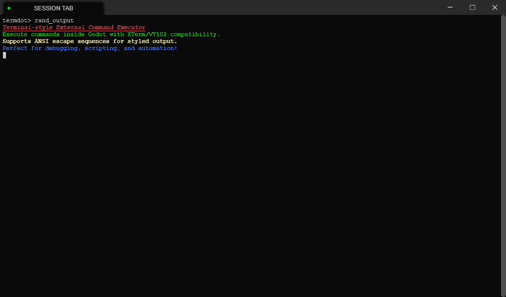

<h1 align="center"> Termdot </h1>

<div align="center" >

  

</div>

Terminal style external command executor for Godot.

Supports control characters and escape sequences of XTerm, VT102.



## Features

- Terminal-style command execution within Godot.
- Commands history cache, auto command completion.
- Supports formatted text output with ANSI-style escape sequences.
- Enables command scripting with execution status handling.
- Designed for extensibility and integration into existing projects.

## Usage

### Installation

1. Copy the `addons/termdot` folder into your project's `addons` directory.
2. In your scene, add a `Termdot` node. This is the main control node for the plugin.
3. Under the `Termdot` node, add `Command` nodes (each `Command` node must be a child of `Termdot`).
4. Write your own command scripts to define behavior.

### Creating a Command Script

Example `Command.gd`:

```gdscript
extends Command

# This method is executed when the command is detected.
# The command is trimmed by spaces, and parameters are passed as `params`.
func _start(params: Array[String]) -> int:
    # Return values:
    # ExecuteStatus.DONE
    # ExecuteStatus.RUNNING

# This method executes when `_start()` returns `ExecuteStatus.RUNNING` and continues
# running until `_running()` itself returns `ExecuteStatus.DONE`.
func _running() -> int:
    var text = AnsiString.new().background_rgb(112, 112, 112).foreground_256(3).italic().append("Hello World").de_italic().clear_style().append("\r\nHello You\r\n")

    # This will print `text` to the terminal. `text` is a special string that can contain
    # control characters and escape sequences for stylized output and cursor control.
    echo(text)

    # Return values:
    # ExecuteStatus.DONE
    # ExecuteStatus.RUNNING
```

## Internal Commands

| Key/Command | Function                        |
| ----------- | ------------------------------- |
| ↑ / ↓       | History commands select.        |
| Tab         | Commands list, auto completion. |
| cls         | Clear entire screen.            |

## License

[MIT license](LICENSE) © Joe Zane
